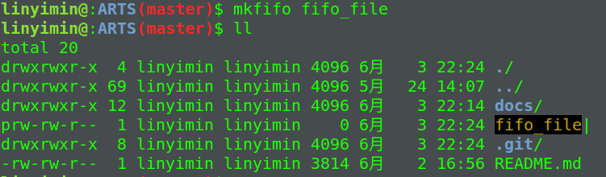

> Time: 2019.06.03 - 2019.06.09
>
> Algorithm: Longest Valid Parentheses
>  
> Review: how-to-self-detect-a-memory-leak-in-node
>
> Tip: Linux管道的使用
> 
> Share: 地址族和数据序列


## Algorithm

### Longest Valid Parentheses

> Given a string containing just the characters '(' and ')', find the length of the longest valid (well-formed) parentheses substring.

**Example 1:**

```
Input: "(()"
Output: 2
Explanation: The longest valid parentheses substring is "()"
```

**Example 2:**

```
Input: ")()())"
Output: 4
Explanation: The longest valid parentheses substring is "()()"
```

### 解法1: 暴力法

使用两重循环, 取出字符串对应的所有子串, 使用栈判断子串是否满足要求,返回满足要求的最长子串的长度,即为结果.

<pre>
时间复杂度: O(N ^ 3)
空间复杂度: O(N)
<font color="#dd0000">Time Limit Exceeded</font>
</pre>


#### 代码实现

```C++
class Solution {
private:
    bool isValid(string s) {
        std::stack<char> left;
        for (int i = 0; i < s.size(); i++) {
            if (s[i] == '(') {
                left.push(s[i]);
                continue;
            }
            if (left.empty()) {
                return false;
            }
            char leftChar = left.top(); left.pop();
        }
        return left.empty();
    }
public:
    int longestValidParentheses(string s) {
        int max = 0;
        for(int i = 0; i < s.size(); i++) {
            for (int j = 2; j <= s.size() - i; j++) {
                string sub = s.substr(i, j);
                if (isValid(sub)) {
                    max = j > max ? j : max;
                }
            }
        }
        return max;
    }
};
```

### 解法2

使用栈数据结构进行解题.

在具体描述算法之前,我们先说明一个定义:

<font color="#dd0000">栈中的第一个元素是每个子串开始的前一个索引位置</font>

所以刚开始时, 先把`-1`压入栈中, 然后遍历字符串, 若是`(`则将其对应的索引压入栈中, 否则移除栈顶元素, 若此时栈为空,说明没有符号与当前符号匹配, 所以将当前元素对应的索引压入栈中, 开始下一个子串的长度的求解(满足之前的定义).若栈不为空,使用当前元素索引减去此时栈顶元素的值,得到当前匹配子串的长度, 取最大长度(和之前匹配的子串长度进行对比).然后接着遍历,直至遍历完整个字符串,即可得到答案.

<pre>
时间复杂度分析: O(N)
空间复杂度分析:O(N)
</pre>

#### 代码实现

```C++
class Solution {
public:
    int longestValidParentheses(string s) {
        std::stack<int> left;
        int max = 0;
        int len = 0;
        left.push(-1);
        for (int i = 0; i < s.size();  i++) {
            if (s[i] == '(') {
                left.push(i);
            } else {
                left.pop();
                if (left.empty()) {
                    left.push(i);
                } else {
                    len = i - left.top();
                    max = max > len ? max : len;
                }
            }
        }
        return max;
    }
};
```

### 动态规划

TODO:

### 参考链接

[Solution](https://leetcode.com/problems/longest-valid-parentheses/solution/)

## Review

[how-to-self-detect-a-memory-leak-in-node](https://www.nearform.com/blog/how-to-self-detect-a-memory-leak-in-node/)

### 追踪Node应用中的内存泄露

使用Node的--flag标签, `memwatch`和`heapdump`两个很棒的工具完成Node应用的内存泄露跟踪

#### 一个简单的内存泄露例子

```javascript
const http = require('http');

var server = http.createServer((req, res) => {
 for (var i=0; i<1000; i++) {
 server.on('request', function leakyfunc() {});
 }

 res.end('Hello World\n');
}).listen(1337, '127.0.0.1');
server.setMaxListeners(0);

console.log('Server running at http://127.0.0.1:1337/. Process PID: ', process.pid);
```

上诉的代码,我们为每个请求添加了额外的1000个监听者.然后使用`autocannonn`进行压测. `autocannon`是一个node实现的压测工具, 使用`sudo npm install autocannon -g`进行安装.

在一个终端中运行`autocannon -c 1 -d 60 http://localhost:1337`进行施压. 


然后打开另一个终端使用`top | head -1; top | grep <process pid>`上面例子对应的进程的内存使用量非常高,而且很不稳定. 


接下来我们如何进行分析呢?

#### 内存泄露探测

`node-memwatch`更适合检测内存泄露. 首先在我们的项目中使用`npm install --save node-memwatch`安装, 然后在代码中添加:

```javascript
const memwatch = require('node-memwatch')

// 添加泄漏事件的监听器
memwatch.on('leak', (info) => {
  console.log('Memory leak detected:\n', info)
})
```

然后继续运行我们的程序, 现在终端会输出以下结果:


可以看到`memwatch`检测到了内存泄露, `memwatch`对泄露事件的定义是: 如果经过连续5次GC, 内存仍被持续分配而没有得到释放

#### 内存泄露分析

接下来, 我们要找出程序哪里出现了内存泄露.虽然我们上面的例子泄露很明显, 但是分析的步骤是一样的:

1. 在不同的时间间隔创建堆存储
2. 比较不同时间间隔的堆存储, 找出什么增长了

有两种方式可以完成上述分析:

1. `--flag`标签

```shell
$ node --inspect index.js
```

打开浏览器,在地址栏输入`chrome://inspect/`, 然后选择`inspect`


使用命令`autocannon -c 1 -d 60 http://localhost:1337`加压

然后点击取得快照, 30秒后在取一次


关于内存更精彩的分析可以查看[Taming The Unicorn: Easing JavaScript Memory Profiling In Chrome DevTools](https://addyosmani.com/blog/taming-the-unicorn-easing-javascript-memory-profiling-in-devtools/)

2. 使用`Heapdump`

`node-heapdump`是一个非常好的工具, 可以在应用代码内部生成一个快照.关于更过`heapdump`可以查看[blog post](https://strongloop.com/strongblog/how-to-heap-snapshots/).现在我们直接在代码中使用`heapdump`, 在每次检查到内存泄露时, 将V8栈快照信息写到磁盘上.

```javascript
memwatch.on('leak', (info) => {
  console.error('Memory leak detected:\n', info);
  heapdump.writeSnapshot((err, filename) => {
    if (err) console.error(err);
    else console.error('Wrote snapshot: ' + filename);
})
```


可以看到生成了相关的快照文件, 导入DevTools即可得到与之前`--inspect`一样的效果.

## Tip

### Linux管道的使用

管道的特点: 

1. 如果管道中没有数据,那么从管道中取数据操作会被阻塞,直到管道内写入数据
2. 写入管道操作没有读取操作,写入操作也会被阻塞,直到管道数据被读出

#### 匿名管道

1. 由shell自动创建,存在内核中
2. 单向字节流

我们经常使用的`|`就是管道,例如`cat text | grep abc`, 直接作为两个进程的数据通道.

#### 命名管道(FIFO: First In First Out)

1. 在文件系统中,`FIFO`拥有名称,存在文件系统中,以设备特殊文件的形式存在
2. 双向字节流

`mkfifo`命令可以创建一个管道,例如`mkfifo fifo_file`.



**向管道中写入数据**

```
$ cat "data" > fifo_file
```

上述命令表示我们想向管道文件中写入数据`data`,由于没有任何进程对它进行读操作,所以进程一直被阻塞.

**从管道中读取数据**

```
$ cat fifo_file
```

上述命令表示我们想从管道文件`fifo_file`中读取文件,此时写进程完成并退出, 并在终端上打印管道文件中的数据`data`.

#### 参考链接

[shell中的多进程【并发】](https://blog.51cto.com/fuwenchao/1564573)
[linux shell命名管道FIFO（多进程动态并发）](https://blog.csdn.net/qq_32642039/article/details/78624210)

## Share

### 地址族和数据序列

#### 网络地址

IP地址是为了收发网络数据而分配给计算机的的值，一个IP可以标识一台主机。IP地址分为两类：

- IPv4(Internet Protocol version 4)： 4字节地址族
- IPv6(Internet Protocol version 6)： 16字节地址族

IPv6是为解决IPv4 IP地址耗尽的问题而提出的新标准。


IPv4的IP地址有两部分组成：`网络地址`及`主机地址`。


网络地址分为A、B、C、D、E五类

|类型|网络地址|网络地址范围|主机地址|
|:---:|:---|:---|:---|
|A|`0`(1个字节)|0~127|3个字节|
|B|`01`(2个字节)|128~191|2个字节|
|C|`011`(3个字节)|192~223|1个字节|
|D|`0111`4个字节|

#### 端口号

网卡通过`IP`地址接收到数据之后，拷贝到内核，内核通过端口号将数据分配给相应的套接字，套接字在将数据传给应用程序。从这可以知道，套接字是在同一操作系统中为了区分不同套接字而设置的，所以不能将一个端口号分配给不同的套接字。


端口号由16位构成，所以可分配的端口号范围是0~65535。但0~1023是知名端口号，一般分配给特定的应用程序。

需要注意的是:<font color="#dd0000">端口号不能重复，但TCP套接字和UDP套接字不会共用端口号，所以是允许重复的</font>


#### IPv4地址信息的表示

由上面的知识我们可以知道，地址由三部分组成：`地址族`（IPv4、IPv6）、`IP地址`、`端口号`

在Linux下使用`sockaddr`和`sockaddr_in`两个结构体来处理网络通信的地址。

我们在调用`bind`函数绑定地址时，使用`sockaddr`的指针作为参数进行传递。但是`sockaddr`是一个通用的结构体，可以表示多种socket的地址。例如`AF_INET`及`AF_UNIX`。

##### sockaddr


```C
struct sockaddr {
  unsigned short sa_family; // 2字节
  char sa_data[14];         // 14字节，表示协议地址
}
```

根据`sockaddr`的定义，变量成员`sa_data`用于指定协议信息。但这个成员变量的操作对于程序员来说，是难以操作的，例如指定一个`AF_INET`，我们需要在`sa_data`中指定`IP`及`port`两个数据。这需要程序员了解`bind`函数的底层实现，才能完成相应的赋值。所以系统提供了另外一个数据结构`sockaddr_in`简化相应的复制操作，将`sockaddr`的操作留给操作系统。


##### sockaddr_in

```C
struct sockaddr_in {
  short sin_family;         // 2个字节， 地址族： AF_INET、AF_INET6
  unsigned short sin_port;  // 两个字节，表示端口
  struct in_addr sin_addr;  // 4字节（IPv4地址）
  char sin_zero[8];         // 8字节
}

struct in_addr {
  unsigned long s_addr;     // 4 字节
}
```

`sockaddr_in`用于IPv4协议族。可以发现`sockaddr_in`将`sockaddr`中的`sa_data`分成了**sin_port**, **sin_addr**及**sin_zero**（为保持与`sockaddr`一致）三部分，这样就可以很轻易的完成IPv4协议族的套接字地址赋值了。


#### 网络字节序与地址变换

在不同的CPU中，内存空间保存数据的方式存在两种方式：

- 大端序：最高有效位（MSB）对应实际地址
- 小端序：最低有效位（LSB）对应实际地址

**网络字节序**：通过网络传输数据时约定的统一的方式——`大端序`称为网络字节序。

#### 字节序转换(Endian Conversion)

##### 主机字节序转网络字节序

- unsigned short htos(unsigned short): 将`short`型数据从主机字节序转成网络字节序
- unsigned long htol(unsigned long): 将`long`型数据从主机字节序转成网络字节序

##### 网络字节序转主机字节序

- unsigned short ntos(unsigned short): 将`short`型数据从网络字节序转成主机字节序
- unsigned long ntol(unsigned long): 将`long`型数据从网络字节序转成主机字节序

##### IP地址ASCII字符串与网络字节序的二进制间的转换

```C
#include<arpa/inet.h>

// 将strptr指向的字符串转成网络字节序的二进制值，并保存在addrptr指针指向的数据结构中
int inet_aton(const char *strptr, struct in_addr *addrptr);

/*
  返回： 若字符串有效则为32位二进制网络字节序的IPv4地址，否则为INADDR_NONE
*/
in_addr_t inet_addr(const char *strptr);

// 将网络字节序的二进制转换成ASCII字符串IP地址
char *inet_ntos(struct in_addr inaddr);
```

**既支持IPv4又支持IPv6**的函数

```c
#include<arpa/inet.h>

// 将strptr指向的字符串形式IP地址，装成网络字节序二进制并保存在指针addrprt中
// 成功返回1， 非有效输入返回0，出错返回-1
int inte_pton(int family, const char *strptr, void *addrprt);

// 将addrstr指向的网络字节序二进制IP转成字符串形式的IP地址，并保存在字符指针strptr中，len指定strprt指向内容的大小
// 成功返回指向结果的指针，若出错则返回NULL
const char *inet_ntop(int family, const void *addrstr, char *strptr, size_t len)
```

#### 习题

（1）IP地址族IPv4和IPv6有何区别？在何种背景下诞生了IPv6？

IPv4为4字节地址族，而IPv6为16字节地址族，IPv6能表示的地址数目远远大于IPv4的数目。在IPv4所表示的IP地址不够用的背景下诞生了IPv6。

（2）通过IPv4网络ID、主机ID及路由器的关系说明向公司局域网中的计算机传输数据的过程。

网络ID是为标识网络而设的一部分IP地址，我们常用的有4类。其中A类包含的网络数最少，但是每个网络中包含的主机数最多。当我们想向公司的局域网发送数据时，路由器会根据网络ID找到目标主机所处网络对应的转发端口，然后将数据包从对应端口转发出去，这个过程可能会经过多个路由器或者交换机，当数据包到达目标主机所在的局域网后，根据主机ID找到对应的主机，然后将数据交给给主机的网卡，此时便完成了数据的传输。

（3）套接字地址分为IP地址和端口号。为什么需要IP地址和端口号？或者说，通过IP可以区分那些对象？通过端口号可以区分那些对象？

IP地址是为了标识不同通信主机的，即确定收发数据的主机。而端口号是为了标识同一系统下多个套接字。`IP+port`提供另一种能唯一标识网络中不同进程的方式。

（4）请说明IP地址的分类方法，并据此说出下面这些IP地址的分类。

|类别|网络ID前缀|网络ID长度|首字节网络ID范围|主机ID长度|
|:---:|:---:|:---:|:---:|:---:|
|A|0|1字节|0~127|3字节|
|B|10|2字节|128~191|2字节|
|C|110|3字节|192~223|1字节|
|D|1110|4字节|224~239|多播IP地址|

- 214.121.212.102（C类地址）
- 120.101.122.89（A类地址）
- 129.78.102.211（B类地址）

（5）计算机通过路由器或者交换机连接到互联网。请说出路由器和交换机的作用。

若想构建网络，需要一种物理设备完成外网与本网主机之间数据的交换。这种设备就是路由器或交换机。一般来说交换机用于构建本地局域网。而路由器将多个局域网构建成一个更大的网络。

（6）什么是知名端口？其范围是多少？知名端口中具有代表性的HTTP和FTP端口号各是多少？

知名端口是指分配给特定应用程序使用的端口号。其范围是：0~1023。HTTP的默认端口是80，FTP默认的端口号是21.

（7）向套接字分配地址的bind函数原型如下：

`int bind(int sockfd, struct sockaddr *myaddr, socklen_t addr_len);`

而调用时则用：

`bind(serv_sock, (struct sockaddr*)&serv_addr, sizeof(serv_addr));`

此处`serv_addr`为`scokadd_in`结构体变量。与函数原型不同，传入的是`sockaddr_in`结构体变量，请说明原因。

`sockaddr`可以用于多种协议族，主要提供给操作系统使用，`sockaddr_in`是提供给开发者用的，用于IPv4和IPv6地址的定义。


（8）请解释大端序、小端序、网络字节序。并说明为何需要网络字节序。

**大端序**： 最高有效位对应实际地址

**小端序**： 最低有效位对应实际地址

**网络序**： 规定网络传输时使用的字节序——大端序

网络字节序为了实现不同存储方式的计算机间的数据传输而定义的一种字节序，在不同存储方式的计算机内核内，接收到消息后可以进行准确的转换。

（9）大端序计算机希望把4字节整数型数据12传递到小端序计算机。请说出数据传输过程中发生的字节序变换过程。

大端序计算机直接将数据传送给小端序计算机，小端序计算机收到数据后将其转换成小端序在交由上层应用程序。

（10）怎样表示回送地址？其含义是什么？如果向回送地址传输数据将会发生什么情况？

回送地址指的是计算机自身的IP地址可以使用`127.0.0.1`或者`localhost`表示。可以正确传输，相当于服务器端和客户端在同一计算机内运行。

#### 参考链接

[Why do we cast sockaddr_in to sockaddr when calling bind()?](https://stackoverflow.com/questions/21099041/why-do-we-cast-sockaddr-in-to-sockaddr-when-calling-bind/21099196)

[sockaddr和sockaddr_in的区别](https://kenby.iteye.com/blog/1149001)

