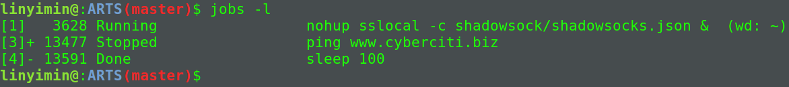

> Time: 2019.06.10 - 2019.06.16
>
> Algorithm: 
>  
> Review: 
>
> Tip: shell进程`jobs`,`fg`,`bg`,`wait`命令的使用
> 
> Share: 


## Algorithm

## Review

## Tip

### shell进程`jobs`, `fg`, `bg`, `wait`命令的使用

当在终端运行某作业时,终端会被该作业占据,若再想重新运行其他作业则需要重新打开一个终端.为了避免这种不方便的操作,我们可以把作业放到后台运行,主要有两种方式:

1. `command` &

命令将脚本放到后台执行，但是标准输出还是会显示到当前终端，影响用户操作，所以最好是将输出重定向到其他文件:

`command &> /dev/null`

2. 首先使用`CTRL + Z`将作业中止,然后使用`bg`命令放到后台中运行

如果一个作业已经在前台执行，可以通过`ctrl+z`将该作业放到后台并挂起。然后通过jobs命令查看在后台执行的作业并找到对应的作业ID，执行`bg %n`(n为通过jobs查到的作业ID)唤醒该作业继续执行。

该方式也存在结果会输出到终端上的情况，同样可以用重定向的方法解决.


### jobs

`jobs`命令用于显示当前终端关联的后台任务情况

#### 常用选项

|选项|功能描述|
|-l|列出进程ID及其他信息|
|-p|只显示进程的ID|
|-n|仅列出上次显示进程后发生变化的进程信息|
|-r|只显示运行着的进程信息|
|-s|只显示停止状态的进程信息|

#### 例子

```shell
$ jobs -l
```



### 

### 参考链接

[jobs 命令示例](https://codingstandards.iteye.com/blog/780581)

## Share