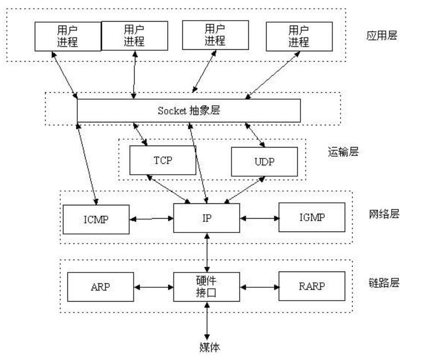

> Time: 2019.04.22 - 2019.04.28
>
> Algorithm: First Missing Positive
>  
> Review: What are some of the best ways to learn programming?
> 
> Share: 网络编程和Socket概要
> 
> Tip: VSCode使用技巧

<!-- TOC -->

- [Algorithm(First Missing Positive)](#algorithmfirst-missing-positive)
  - [解法1: 使用额外的数组空间](#%E8%A7%A3%E6%B3%951-%E4%BD%BF%E7%94%A8%E9%A2%9D%E5%A4%96%E7%9A%84%E6%95%B0%E7%BB%84%E7%A9%BA%E9%97%B4)
    - [分析](#%E5%88%86%E6%9E%90)
    - [代码实现](#%E4%BB%A3%E7%A0%81%E5%AE%9E%E7%8E%B0)
  - [解法2](#%E8%A7%A3%E6%B3%952)
    - [分析](#%E5%88%86%E6%9E%90-1)
    - [代码实现](#%E4%BB%A3%E7%A0%81%E5%AE%9E%E7%8E%B0-1)
- [Review](#review)
  - [专注于兴趣，而非目标](#%E4%B8%93%E6%B3%A8%E4%BA%8E%E5%85%B4%E8%B6%A3%E8%80%8C%E9%9D%9E%E7%9B%AE%E6%A0%87)
  - [单独学习是痛苦的](#%E5%8D%95%E7%8B%AC%E5%AD%A6%E4%B9%A0%E6%98%AF%E7%97%9B%E8%8B%A6%E7%9A%84)
  - [编写项目](#%E7%BC%96%E5%86%99%E9%A1%B9%E7%9B%AE)
- [Share(网络编程和Socket概要)](#share%E7%BD%91%E7%BB%9C%E7%BC%96%E7%A8%8B%E5%92%8Csocket%E6%A6%82%E8%A6%81)
- [网络编程和Socket概要](#%E7%BD%91%E7%BB%9C%E7%BC%96%E7%A8%8B%E5%92%8Csocket%E6%A6%82%E8%A6%81)
  - [Socket的类型](#socket%E7%9A%84%E7%B1%BB%E5%9E%8B)
  - [服务器端socket(接受连接请求)](#%E6%9C%8D%E5%8A%A1%E5%99%A8%E7%AB%AFsocket%E6%8E%A5%E5%8F%97%E8%BF%9E%E6%8E%A5%E8%AF%B7%E6%B1%82)
  - [客户端socket(请求连接)](#%E5%AE%A2%E6%88%B7%E7%AB%AFsocket%E8%AF%B7%E6%B1%82%E8%BF%9E%E6%8E%A5)
  - [补充：基于Linux的文件操作](#%E8%A1%A5%E5%85%85%E5%9F%BA%E4%BA%8Elinux%E7%9A%84%E6%96%87%E4%BB%B6%E6%93%8D%E4%BD%9C)
    - [文件描述符(File Descriptor)](#%E6%96%87%E4%BB%B6%E6%8F%8F%E8%BF%B0%E7%AC%A6file-descriptor)
  - [补充：以`_t`为后缀的数据类型](#%E8%A1%A5%E5%85%85%E4%BB%A5t%E4%B8%BA%E5%90%8E%E7%BC%80%E7%9A%84%E6%95%B0%E6%8D%AE%E7%B1%BB%E5%9E%8B)
  - [参考连接](#%E5%8F%82%E8%80%83%E8%BF%9E%E6%8E%A5)
- [Tip](#tip)
  - [VSCode使用技巧](#vscode%E4%BD%BF%E7%94%A8%E6%8A%80%E5%B7%A7)
    - [主命令框](#%E4%B8%BB%E5%91%BD%E4%BB%A4%E6%A1%86)
    - [常用快捷键](#%E5%B8%B8%E7%94%A8%E5%BF%AB%E6%8D%B7%E9%94%AE)

<!-- /TOC -->

## Algorithm(First Missing Positive)

> Given an unsorted integer array, find the smallest missing positive integer.

**Example 1:**

```
Input: [1,2,0]
Output: 3
```

**Example 2:**

```
Input: [3,4,-1,1]
Output: 2
```

**Example 3:**

```
Input: [7,8,9,11,12]
Output: 1
```

**Note:**

Your algorithm should run in O(n) time and uses constant extra space.


### 解法1: 使用额外的数组空间

<font color="#dd0000">这种解法不符合题目的要求，但是也能AC</font>


#### 分析

由于是在数组中寻找缺失的最小正整数，不妨设数组长度为N, 那么缺失的最小正整数的区间必然在`[1, N+1]`中， 所以很容易想到使用一个额外的数组`temp`空间存储原数组中的正整数，使得`temp[i - 1] = i, 1 <= i <= N`, 然后遍历额外的数组空间，若存在`temp[i] != i + 1; 0 <= i < N;`则返回`i+1`, 否则返回`N+1`。

#### 代码实现

```C
int firstMissingPositive(int* nums, int numsSize){
  // 开辟额外的数组空间
  int * temp = malloc(numsSize * sizeof(int));
  // 初始化数组空间为0
  for (int i = 0; i < numsSize; i++) {
    temp[i] = 0;
  }
  
  // 填充数据,使得temp[i] = i + 1
  for (int i = 0; i < numsSize; i++) {
    // 对于小于0或者大于N的元素直接丢弃
    if (nums[i] >= 1 && nums[i] <= numsSize) {
        temp[nums[i] - 1] = nums[i];
    }
  }
  // 遍历找出最小正整数
  for (int i = 0; i < numsSize; i++) {
    if (temp[i] != i+1) {
        return i + 1;
    }
  }
  return numsSize + 1;
}
```

### 解法2


#### 分析

解法2和解法1基于相同的思想,区别在于: <font color="#dd0000">解法2在原数组上进行元素交换, 不需要开辟额外的数组空间</font>

#### 代码实现

```C
void swap(int *a, int *b) {
  int temp = *a;
  *a = *b;
  *b = temp;
}
int firstMissingPositive(int* nums, int numsSize){
  int i = 0;
  while (i < numsSize) {
    // 对于小于0或者大于N的元素直接丢弃
    if (nums[i] >=1 && nums[i] <= numsSize && nums[i] != i + 1 && nums[i] != nums[nums[i] - 1]) {
      // nums[nums[i] - 1] = nums[i],此时索引nums[i] - 1满足要求,但是索引i仍未满足nums[i] = i + 1
      swap(&nums[i], &nums[nums[i] - 1]);
    } else {
      i++;
    }
  }
  
  // 遍历找出最小正整数
  for (int i = 0; i < numsSize; i++) {
    if (nums[i] != i+1) {
        return i + 1;
    }
  }
  return numsSize + 1;
}
```

## Review

[What are some of the best ways to learn programming?](https://www.quora.com/What-are-some-of-the-best-ways-to-learn-programming)

### 专注于兴趣，而非目标

如果你每周花20-30小时专注于建立编程的兴趣，你会实现成为一名Web开发者的目标。如果你专注于在几个月内成为一名Web开发者的目标，你不会从中收获什么，返回会很有压力。

### 单独学习是痛苦的

1. 找一个导师
2. 寻找一个社区


### 编写项目

## Share(网络编程和Socket概要)

## 网络编程和Socket概要

**网络编程**就是编写程序使两台联网的计算机相互交换数据。

我们知道两个进程间想通信，前提是能找到对方(进程需要有唯一的标识)。在Linux系统中我们使用PID来唯一标识一个进程。但是PID只是在本地唯一，在网络中PID冲突的几率很大，我们需要提供另一种能唯一标识网络中不同进程的方式。我们知道IP层的IP地址可以唯一标识一台主机，而TCP层协议和端口号可以唯一标识主机中的一个进程。所以可以通过`IP地址 + 协议 + 端口`来唯一标识网络中的一个进程。

**Socket**由操作系统提供的网络数据传输接口。可以理解为`Socket`是应用层和传输层之间的一个抽象层，将TCP/IP层复杂的操作抽象成几个简单的接口供应用层调用，以实现进程在网络中的通信。



`socket`起源于`Unix`，在`Unix`一切皆文件的思想下，`socket`也是一种文件，遵循`打开-读/写-关闭`的模式。服务器端和客户端各自维护一个`socket`文件，在建立连接之后，可以向自己的文件中写入数据供对方读取，或者读取对方内容，通信结束时关闭`socket`文件。

### Socket的类型

### 服务器端socket(接受连接请求)

服务器socket又称监听(listening)socket。创建过程如下：

1. 调用`socket()`函数创建套接字；
2. 调用`bind()`函数分配IP地址和端口号；
3. 调用`listen()`函数转为可接收请求状态；
4. 调用`accept()`函数处理连接请求。

### 客户端socket(请求连接)

创建过程如下：

1. 调用`socket()`函数创建套接字；
2. 调用`connect()`函数向服务器端发送连接请求。

### 补充：基于Linux的文件操作

上面说到过，Unix和Linux下“一切皆文件”的思想。对于Linux而言，socket操作和文件操作没有区别，所以在网络数据传输过程中可以使用文件I/O的相关函数。但是对于Windows来说，是区分socket和文件的，所以在Windows中要调用特殊的数据传输相关函数。

#### 文件描述符(File Descriptor)

文件描述符是操作系统分配给文件或者socket的整数。程序通过文件描述符操作文件和socket。在Linux中常用的3个文件描述符：

|文件描述符|对象|
|:---:|:---|
|0|标准输入: Standard Input|
|1|标准输出: Standard Output|
|2|标准错误: Standard Error|

### 补充：以`_t`为后缀的数据类型

在`sys/types.h`文件中使用`typedef`定义了很多新的基本数据类型别名。例如： `size_t`、`ssize_t`等。

原因：目前主流操作系统和计算机的`int`是32位的。而在过去16位操作系统的年代，`int`类型是16位的。根据系统的不同，数据类型的表示形式随之变化，需要修改程序中使用的数据类型。如果在之前已在需要声明4字节数据类型之处使用了`size_t`或者`ssize_t`，则将大大减少代码的变动，因为只需要修改并编译`size_t`或者`ssize_t`的`typedef`声明即可。为了与程序员定义的新数据类型加以区分，操作系统定义的数据类型会添加后缀`_t`。

### 参考连接

[简单理解Socket](https://www.cnblogs.com/dolphinX/p/3460545.html)

## Tip

### VSCode使用技巧

#### 主命令框

快捷键打开`Ctrl + Shift + P`或者`F1`打开命令面板.

- \> 执行VSCode中的命令
- 直接输入文件名,跳转文件
- ? 列出当前可执行的操作
- : 跳转到指定行数
- @ 跳转到Symbol(搜索变量或者函数)


#### 常用快捷键

- `Ctrl + G`: 跳转到指定行
- `F8`: 跳转到下一个error或者warning
- `F12`: 跳转到定义处
- `F2`: 重命名
- `Ctrl + F`: 查找
- `Ctrl + H`: 查找替换
- `Shift + Ctrl + F`: 这个文件夹中查找