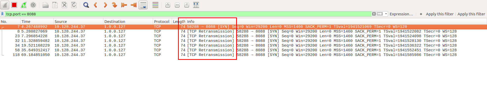
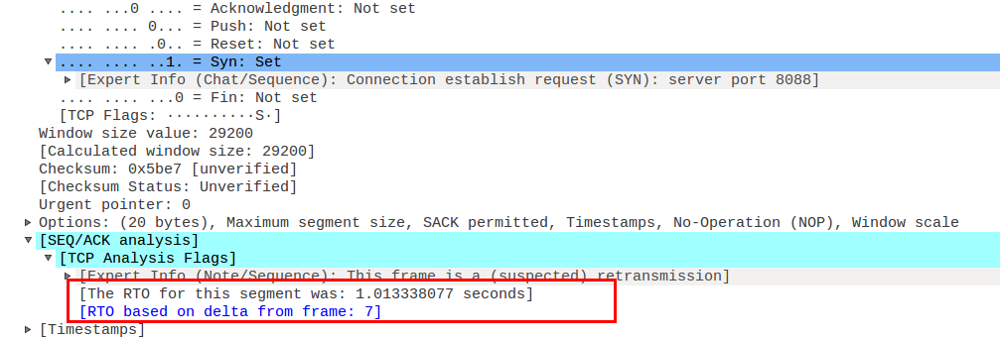
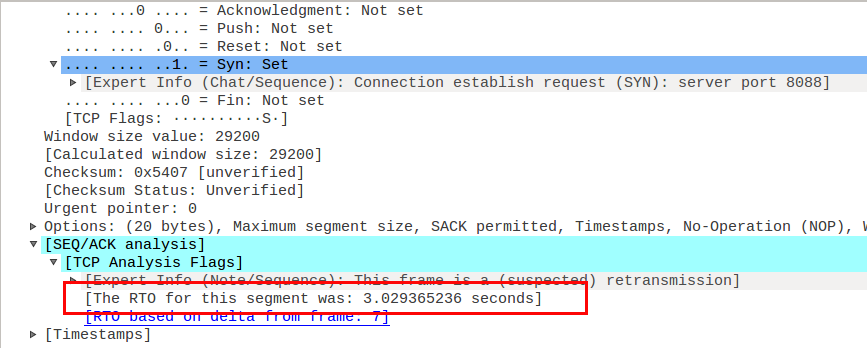
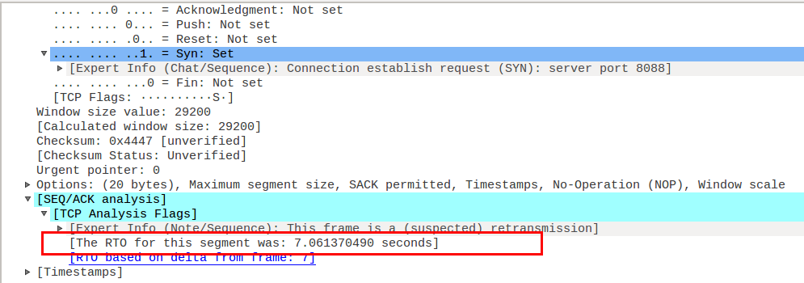
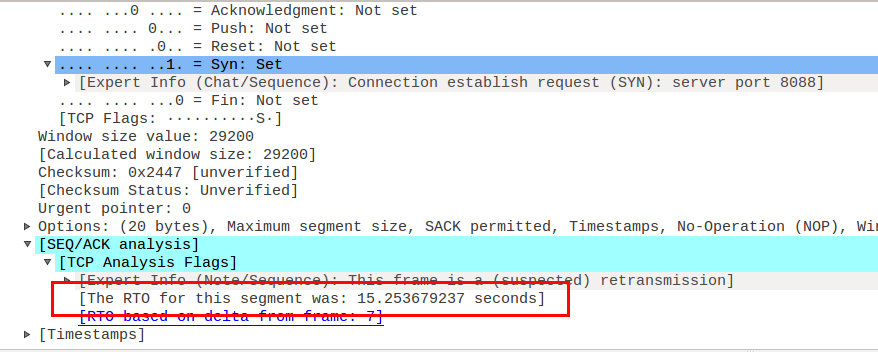
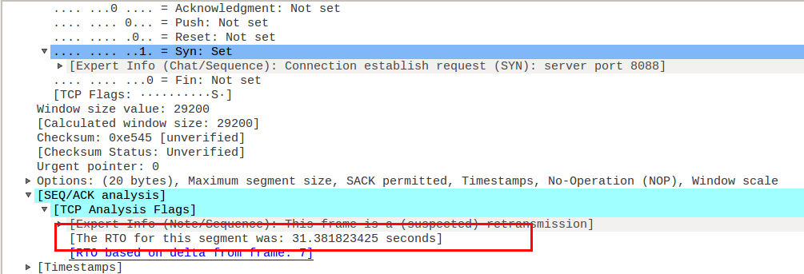
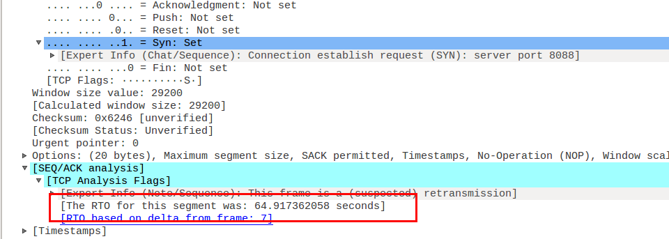

> Time: 2019.04.29 - 2019.05.05
>
> Algorithm: Merge K Sorted Lists
>  
> Review: 7 Critical Tips to Learn Programming Faster?

> Tip: 警惕整数乘法溢出漏洞
> 
> Share: 使用wireshark查找socket连接失败

<!-- TOC -->

- [Merge k Sorted Lists](#merge-k-sorted-lists)
  - [解法1](#%E8%A7%A3%E6%B3%951)
  - [代码实现](#%E4%BB%A3%E7%A0%81%E5%AE%9E%E7%8E%B0)
  - [分析](#%E5%88%86%E6%9E%90)
- [Review](#review)
  - [7个提高学习编程效率的建议](#7%E4%B8%AA%E6%8F%90%E9%AB%98%E5%AD%A6%E4%B9%A0%E7%BC%96%E7%A8%8B%E6%95%88%E7%8E%87%E7%9A%84%E5%BB%BA%E8%AE%AE)
- [Tip](#tip)
  - [警惕乘法溢出漏洞](#%E8%AD%A6%E6%83%95%E4%B9%98%E6%B3%95%E6%BA%A2%E5%87%BA%E6%BC%8F%E6%B4%9E)
    - [代码](#%E4%BB%A3%E7%A0%81)
    - [分析](#%E5%88%86%E6%9E%90-1)
- [Share(使用wireshark查找socket连失败)](#share%E4%BD%BF%E7%94%A8wireshark%E6%9F%A5%E6%89%BEsocket%E8%BF%9E%E5%A4%B1%E8%B4%A5)
  - [使用wireshark查找socket连失败](#%E4%BD%BF%E7%94%A8wireshark%E6%9F%A5%E6%89%BEsocket%E8%BF%9E%E5%A4%B1%E8%B4%A5)
    - [字节序与网络字节序](#%E5%AD%97%E8%8A%82%E5%BA%8F%E4%B8%8E%E7%BD%91%E7%BB%9C%E5%AD%97%E8%8A%82%E5%BA%8F)
      - [字节序转换](#%E5%AD%97%E8%8A%82%E5%BA%8F%E8%BD%AC%E6%8D%A2)
    - [相关代码](#%E7%9B%B8%E5%85%B3%E4%BB%A3%E7%A0%81)

<!-- /TOC -->

## Merge k Sorted Lists

> Merge k sorted linked lists and return it as one sorted list. Analyze and describe its complexity.

**Example:**

```
Input:
[
  1->4->5,
  1->3->4,
  2->6
]
Output: 1->1->2->3->4->4->5->6
```

### 解法1

使用最小堆(优先队列)实现.

1. 构建`pair<int value, ListNode *node>`作为优先队列的基本元素
2. 遍历`vector`中所有链表, 生成长度为`lists.size()`最小优先队列
3. 声明结果链表头指针`head`和尾指针`prev`
4. 取出堆顶元素加入结果链表, 并判断堆顶元素中`node.next`是否为空, 若不为空,将`pair(node.next.val, node.next)`插入优先队列
5. 重复第4步,直至优先队列为空,即可完成`k`个有序链表的合并操作.

### 代码实现

```C++
/**
 * Definition for singly-linked list.
 * struct ListNode {
 *     int val;
 *     ListNode *next;
 *     ListNode(int x) : val(x), next(NULL) {}
 * };
 */
class Solution {
public:
    ListNode* mergeKLists(std::vector<ListNode*>& lists) {
        ListNode * head = NULL;
        ListNode * prev = NULL;
        std::priority_queue<std::pair<int, ListNode*>, std::vector<std::pair<int, ListNode *>>, std::greater<std::pair<int, ListNode*>>> queue;

        for (auto list : lists) {
            if (list) {
                queue.push(std::make_pair(list -> val, list));
            }
        }

        while (!queue.empty()) {
            std::pair<int, ListNode*> top = queue.top(); queue.pop();
            ListNode *node = top.second;
            if (!prev) {
                head = node;
            } else {
                prev->next = node;
            }

            prev = node;
            node = node->next;
            if (node) {
                queue.push(std::make_pair(node->val, node));
            }
        }
        return head;
    }
};
```

### 分析

**时间复杂度**: `O(n * log k)`

**空间复杂度**: `O(k)`


## Review

[7 Critical Tips to Learn Programming Faster](https://www.codingdojo.com/blog/7-tips-learn-programming-faster)

### 7个提高学习编程效率的建议

1. 通过实践学习(Learn by doing)

2. 为了长期目标需要掌握相关基础

3. 手写代码,提高熟练度(找工作需要)

4. 主动寻求帮助

5. 寻找更多在线资源

6. 不要只读源码范例, 还要修改它

7. 调试时学会休息一下

## Tip

### 警惕乘法溢出漏洞

目前在Coursera上[计算机系统基础（一） ：程序的表示、转换与链接](https://www.coursera.org/learn/jisuanji-xitong/home/welcome)这门课,里面有讲到一个使用`乘法溢出漏洞`攻击的例子, 觉得非常有意思.

下面是是一个复制数组到堆中的例子, count为数组元素的个数

#### 代码

```C
int copy_array(int * array, int count) {
  int i;
  /* 在堆区申请一块内存*/
  int *myarray = (int *) malloc(count * sizeof(int));
  if (myarray == NULL) {
    return -1;
  }
  for (int i = 0; i < count; i++) {
    myarray[i] = array[i];
  }
  return count;
}
```

#### 分析

当`count`很大时,则`count * sizeof(int)`会发生溢出, 例如`count=2 ^ 30 + 1`时, `count=4`, 所以实际上,上述代码只在堆中申请了4字节的内存空间, 在循环遍历拷贝数组的时候,<font color="#dd0000">堆中的大量数据会被破坏</font>.所以攻击者可以通过构造特殊参数来触发整数溢出,以一段预设信息覆盖一个已分配的缓冲区,造成远程服务器崩溃或者改变内存数据并执行任意代码.

所以在写程序的时候,不仅要<font color="#dd0000">考虑逻辑是否正确, 还要考虑所使用的数据类型及相关计算是否合理</font>


## Share(使用wireshark查找socket连失败)

### 使用wireshark查找socket连失败

在实现《TCP/IP网络编程》第5章的`计算器服务器端/客户端示例`时,服务器端和客户端代码都已经实现好了,相关代码如下.根据代码,当客户端连上服务器时,服务器端会打印`Connected...`字符串, 客户端会打印`Operand count: `提示输入相关信息.但是当运行的时候发现服务器端和客户端都没有打印相关信息, 服务器端和客户端一直在阻塞,也没有提示相关错误.大概两分钟后,客户端提示`connect() error.`

找了好久的原因也没找到(缺少错误信息提示), 于是就想着使用`wireshark`抓包分析一下, 没想到一抓包就找到了问题.



根据抓包信息,可以发现客户端发出的`SYN`数据段一直在超时重传.也就是服务器端一直收不到客户端的连接请求.再看`Destination`列发现, 客户端指定的服务IP居然是`1.0.0.127`, 很明显是客户端在网络地址初始化时出现了错误.查看客户端网络地址初始化的代码(如下):

```C
// init network address
memset(&server_addr, 0, sizeof(server_addr));
server_addr.sin_family = AF_INET;
server_addr.sin_addr.s_addr = htonl(inet_addr(argv[1]));
server_addr.sin_port = htons(atoi(argv[2]));
client_sock = socket(PF_INET, SOCK_STREAM, 0);
```

与IP地址相关的是第4行代码, 运行时输入的是`127.0.0.1`,为什么会变成`1.0.0.127`了呢?这个与CPU在内存中保存数据的方式有关.

#### 字节序与网络字节序

CPU向内存中保存数据有两种方式:

- 大端序: 高位字节存放在低位地址(最高有效位对应实际地址)

- 小端序: 低位字节存放在高位地址(最低有效位对应实际地址)

目前主流的Intel系列CPU以小端序保存数据.由于存在不同的数据保存方式,所以两台字节序不同的计算机之间交换数据会出现问题.为了解决这个问题, 通过网络传输数据时需要约定统一方式,这种约定方式称为`网络字节序`, 目前统一为<font color="#dd0000">大端序</font>: 即先把数据数组转换成大端序格式在进行网络传输.

##### 字节序转换

在头文件`arpa/inet.h`中定义了如下常用的字节序转换函数:

- unsigned short htons(unsigned short);
- unsigned short ntohs(unsigned short);
- unsigned long htonl(unsigned long);
- unsigned long ntohl(unsigned long);

<pre>
htons中:
  h代表主机(host)字节序
  n代表网络(network)字节序
  s代表short类型
  l代表long类型
</pre>

在<arpa/inet.h>还提供了一个将字符串形式的IP地址转换成32位整型数据(<font color="#dd0000">大端序</font>)的函数`in_addr_t inet_addr(const char *string)`.

在对网络地址的初始化代码中, 先调用`inet_addr()`将字符串IP地址转成了大端序的整型数据, 然后有调用`htonl()`函数将大端序的IP地址转成小端序的整型数据.也就是使用小端序的数据在网络上传输, 所以小端序主机解析出来的就是`1.0.0.127`.至此, 终于能明白为什么传入的是`127.0.0.1`最后会变成了`1.0.0.127`.

在抓包中,我们还可以发现, 超时重传时间的变化规律:

**第一次重传**



**第二次重传**



**第三次重传**



**第四次重传**



**第五次重传**



**第六次重传**



<font color="#dd0000">1.01 --> 3.02 --> 7.06 --> 15.25 --> 31.38 --> 64.91</font>超时重传时间基本上以2倍的速度在增长,一共重传6次之后,如果还没有收到确认,则直接断开,不再重传. 

#### 相关代码

**op_server.c**

```C

#include <stdio.h>
#include <stdlib.h>
#include <sys/socket.h>
#include <arpa/inet.h>
#include <unistd.h>
#include <string.h>

#define OPSZ 4
#define BUF_SIZE 1024

void error_handling(char *message) {
    fputs(message, stderr);
    fputc('\n', stderr);
    exit(1);
}

int calculate(int opnum, int opinfo[], char op) {
    int result = opinfo[0];
    switch (op) {
        case '+': {
            for (int i = 1; i < opnum; i++) {
                result += opinfo[i];
            }
            break;
        }
        case '-': {
            for (int i = 1; i < opnum; i++) {
                result -= opinfo[i];
            }
            break;
        }
        case '*': {
            for (int i = 1; i < opnum; i++) {
                result *= opinfo[i];
            }
            break;
        }
        case '/': {
            for (int i = 1; i < opnum; i++) {
                result /= opinfo[i];
            }
            break;
        }
    }

    return result;
}

int main(int argc, char *argv[]) {
    int server_sock;
    int client_sock;

    char opinfo[BUF_SIZE];

    struct sockaddr_in server_addr;

    if (argc != 2) {
        printf("Usage: %s <port>", argv[0]);
        exit(1);
    }

    server_sock = socket(PF_INET, SOCK_STREAM, 0);
    if (server_sock == -1) {
        error_handling("socket() error");
    }

    // init network address
    memset(&server_addr, 0, sizeof(server_addr));
    server_addr.sin_family = AF_INET;
    server_addr.sin_port = htons(atoi(argv[1]));
    server_addr.sin_addr.s_addr = htonl(INADDR_ANY);

    if (bind(server_sock, (const struct sockaddr *) &server_addr, sizeof(server_addr)) == -1) {
        error_handling("bind() error");
    }

    if (listen(server_sock, 5) == -1) {
        error_handling("listen() error");
    }

    struct sockaddr_in client_addr;
    socklen_t client_addr_size = sizeof(client_addr);

    for (int i = 0; i , 5; i++) {
        client_sock = accept(server_sock, (struct sockaddr *) &client_addr, &client_addr_size);
        if (client_sock == -1) {
            error_handling("accept() error");
        } else {
            printf("Connected ...\n");
            printf("client info: \n");
            printf("server: %s, port: %u", inet_ntoa(client_addr.sin_addr), client_addr.sin_port);
        }

        int opnd_cnt = 0;
        read(client_sock, &opnd_cnt, 1);

        int rev_len = 0;
        while ((opnd_cnt * OPSZ + 1) > rev_len) {
            int rev_cnt = read(client_sock, &opinfo[rev_len], BUF_SIZE - 1);
            rev_len += rev_cnt;
        }
        int result = calculate(opnd_cnt, (int *)opinfo, opinfo[rev_len - 1]);
        write(client_sock, &result, sizeof(result));
        close(client_sock);
    }
    close(server_sock);
    return 0;
}
```


**op_client.c**

```C
#include <stdlib.h>
#include <stdio.h>
#include <sys/socket.h>
#include <arpa/inet.h>
#include <unistd.h>
#include <string.h>

#define BUF_SIZE 1024
#define RLT_SIZE 4
#define OPSZ 4

void error_handling(char *message) {
    fputs(message, stderr);
    exit(0);
}

int main(int argc, char *argv[]) {
    int client_sock;
    struct sockaddr_in server_addr;

    char opmsg[BUF_SIZE];   // 存储操作数
    int result, opnd_cnt;

    char message[BUF_SIZE];
    if (argc != 3) {
        printf("Usage: %s <ip> <port>\n", argv[0]);
        exit(1);
    }

    // init network address
    memset(&server_addr, 0, sizeof(server_addr));
    server_addr.sin_family = AF_INET;
    server_addr.sin_addr.s_addr = htonl(inet_addr(argv[1]));
    server_addr.sin_port = htons(atoi(argv[2]));

    client_sock = socket(PF_INET, SOCK_STREAM, 0);

    if (client_sock == -1) {
        error_handling("socket() error");
    }

    if (connect(client_sock, (const struct sockaddr *) &server_addr, sizeof(server_addr)) == -1) {
        error_handling("connect() error");
    }

    fputs("Operand count: ", stdout);
    scanf("%d", &opnd_cnt);
    opmsg[0] = (char)opnd_cnt;

    for (int i = 0; i < opnd_cnt; i++) {
        printf("Operand: %d", i+1);
        scanf("%d", (int *)&opmsg[OPSZ * i + 1]);
    }
    fgetc(stdin);
    fputs("Operator: ", stdout);
    scanf("%c", &opmsg[OPSZ * opnd_cnt + 1]);
    // send data to server
    write(client_sock, opmsg, opnd_cnt * OPSZ + 2);
    // received data from server
    read(client_sock, &result, RLT_SIZE);
    printf("Operation result: %d\n", result);
    close(client_sock);
    return 0;
}
```

