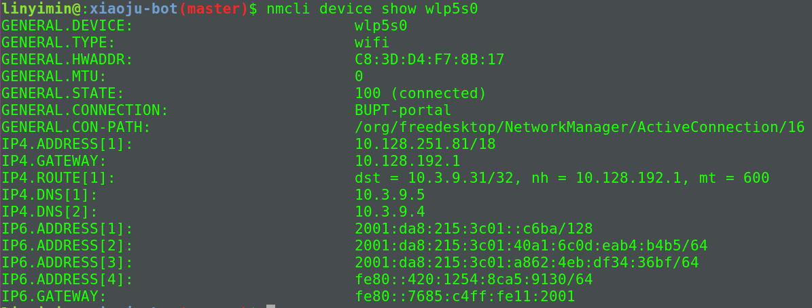

> Time: 2019.05.06 - 2019.05.12
>
> Algorithm: Evaluate Reverse Polish Notation
>  
> Review: Process  Environment
>
> Tip: 由"socket程序listen之后不accept"说起 
> 
> Share: 域名及网络地址 

## Algorithm

### Evaluate Reverse Polish Notation

> Evaluate the value of an arithmetic expression in Reverse Polish Notation.
> 
> Valid operators are +, -, *, /. Each operand may be an integer or another expression.

**Note:**

```
Division between two integers should truncate toward zero.
The given RPN expression is always valid. That means the expression would always evaluate to a result and there won't be any divide by zero operation.
```

**Example 1:**

```
Input: ["2", "1", "+", "3", "*"]
Output: 9
Explanation: ((2 + 1) * 3) = 9
```

**Example 2:**

```
Input: ["4", "13", "5", "/", "+"]
Output: 6
Explanation: (4 + (13 / 5)) = 6
```

**Example 3:**

```
Input: ["10", "6", "9", "3", "+", "-11", "*", "/", "*", "17", "+", "5", "+"]
Output: 22
Explanation: 
  ((10 * (6 / ((9 + 3) * -11))) + 17) + 5
= ((10 * (6 / (12 * -11))) + 17) + 5
= ((10 * (6 / -132)) + 17) + 5
= ((10 * 0) + 17) + 5
= (0 + 17) + 5
= 17 + 5
= 22
```

### 解题思路

根据`后缀表达式`的定义可以知道<font color="#dd0000">运算符前两个数与该运算符组成的表达式优先计算</font>.所以使用栈即可完成相应的计算.(使用栈保存左右操作数)

1. 遍历输入数组, 若对应的元素是运算符,则从栈中取出左右操作数,然后与该运算符进行相应运算,然后把运算结果压入栈中.这里需要注意的是,先出栈的是右操作数.然后继续遍历.
2. 若对应的元素是操作数,直接压入栈中,然后继续遍历.
3. 最后栈中的元素即最终运算结果.

### 代码实现

```C++
class Solution {
public:
    int evalRPN(vector<string>& tokens) {
        std::stack<int> s;
        for (int i = 0; i < tokens.size(); i++) {
            if (tokens[i] == "+" || tokens[i] == "-" || tokens[i] == "*" || tokens[i] == "/") {
                int right = s.top(); s.pop();
                int left = s.top(); s.pop();
                int result = 0;
                if (tokens[i] == "+") {
                     result = left + right;
                }
                if (tokens[i] == "-") {
                     result = left - right;
                }
                if (tokens[i] == "*") {
                     result = left * right;
                }
                if (tokens[i] == "/") {
                     result = left / right;
                }
                s.push(result);
            } else {
                s.push(std::stoi(tokens[i]));
            }
        }
        return s.top();
    }
};
```

## Review

[Unix环境高级编程第七章---进程环境](process Environment)

 ### 综述
 
 本章主要介绍: 
 
1. 当程序执行时,`main`函数是如何被调用的;
2. 命令行参数如何传递给程序;
3. 典型的内存布局是怎样的;
4. 如何分配额外的内存空间
5. 进程如何使用环境变量
6. 进程终止的方式
7. `setjmp`和`longjmp`函数
8. 进程的资源限制
 
### main 函数
 
有内核中的`exec`函数执行, `exec`启动程序还会从内核中读取命令行参数和环境变量传给C程序的`main`函数.
 
### 进程终止

Linux中有8种方式来终止一个进程.

其中正常终止有5钟:

1. `main`函数中调用`return`函数
2. 调用`exit`函数
3. 调用`_exit`或者`_Exit`函数
4. 启动进程中最后一个线程调用`return`函数
5. 最后一个线程调用`pthread_exit`函数

异常终止包含3钟:

1. 调用`abort`函数
2. 收到信号(signal)
3. 收到最后一个线程取消请求的响应

#### exit 函数

- `_exit`和`_Exit`直接返回给内核(kernel)

- `exit`函数会进行相关的清理工作,然后才返回给内核(kernel)

- `exit(0)` is the same as `return(0)`

#### atexit 函数

在标准C中,进程可以给`exit`函数注册处理函数, 在调用`exit`函数退出时,这些处理函数会先被执行.

通过`atexit`函数完成处理函数的注册:

```C
#include <stdlib.h>

int atexit(void (*func)(void));
```

根据这个函数的定义,我们可以知道, 处理函数既不接收任何参数也不返回任何值.需要注意的一点是:<font color="#dd0000">处理函数的执行顺序与注册的顺序相反</font>

在IOS C(标准C)和POSIX标准下, `exit`函数先调用通过`atexit`函数注册的处理函数,然后关闭所有打开的文件流

### 命令行参数

当一个程序被执行了之后, 可以接收来自命令行的执行参数.

#### 例子

```C
#include "apue.h"
int main(int argc, char *argv[]) {
  for (int i = 0; i < argc; i++) {
    printf("argv[%d]: %s\n", i, argv[i]);
  }
  exit(0);
}
```

**注意:**<font color="#dd0000">在IOS C和POSIX中, argv[argc]是一个空指针</font>, 所以处理命令行参数个循环语句可以改写成如下形式:

```C
for(int i = 0; argv[i] != NULL; i++) {
  
}
```

### 环境变量列表

每个运行的程序都会被传递一个环境变量列表,这个环境变量列表是一个字符指针数组, 这个字符数组的指针保存在`environ`全局变量中.

```C
extern char **environ;
```

例如,如果该变量包含5个字符串, 则其内存形式如下:


但是,我们一般不直接使用`environ`变量来访问, 而是使用`getenv`和`putenv`这两个函数来完成. 

### C程序的内存布局

一个C程序一般由以下几部分组成:

- Text段: 由CPU可执行指令组成.通常text段是可共享的且是只读不可写的
- 初始化数据段: 保存已经初始化的全局变量.
- 未初始化数据段: 保存未被初始化的全局变量
- 栈: 保存`automatic`定义的局部变量以及函数调用时的相关数据
- 堆: 动态分配的内存空间


对于运行在32位x86处理器的Linux系统而言, text段开始于`0x08048000`, stack的底部地址开始于`0xC0000000`.

### 共享库

如今大部分的Unix系统都支持共享库.共享库从可执行文件中移除了公共库程序, 然后只在在内存其他区域维护一份库程序, 所有的程序通过引用进行访问.

对于共享库有主要有2个优点:

1. 减少可执行文件的大小;
2. 更换版本简单.

### 内存分配

IOS C提供了三个函数用于内存的分配:

- `malloc`: 分配指定数目字节内存空间,初始值不确定;
- `calloc`: 为指定数目的对象分配指定大小的内存空间, 初始值全为0;
- `realloc`: 添加或减少内存空间, 新增的内存空间对应的值不确定;

由于上述三个函数都返回一个空指针,所以需要我们进行显式的类型转换,否则可能会存在隐藏性错误.在调用`free`函数释放分配的内存空间,一般不会直接返回给内核,而是保存在`alloc`内存池中,供下次调用`alloc`函数使用.

#### 关于内存操作会存在的一些错误

1. 在动态缓存空间前面或后面的地址空间写入数据
2. 释放已经释放的内存空间
3. 对并非通过`alloc`函数获得的指针调用`free`函数释放内存空间
4. 内存泄露(对已经不再使用的内存空间没有释放)

### 环境变量

#### 获取环境变量 

```C
#include<stdlib.h>

char *getenv(const char *name);
```

如果存在`name`对应的值,则返回值对应的指针,否则返回`NULL`.

<font color="#dd0000">我们应该使用`getenv`函数来获取指定的环境变量值, 而不是直接使用`environ`变量</font>

#### 设置环境变量

<font color="#dd0000">我们只能设置或者修改当前进程或者子进程的环境变量,而不能修改父进程(shell)对应的环境变量.</font>

```C
#include<stdlib.h>

int putenv(char *str);

int setenv(const char *name, const char *value, int rewrite);

int unsetenv(const char *name);
```

- `putenv`: 以`name=value`的形式设置环境变量, 若`name`已经存在,则修改其对应的值
- `setenv`: 将`name`对应的值设为`value`, 当`name`已经存在时, 若`rewrite=1`时, 覆盖旧值.否则不做改变直接返回
- `unsetenv`: 删除`name`对应的环境变量


<font color="#dd0000">`setenv`需要为环境变量分配额外的内存空间.而`putenv`不需要为环境变量字符串分配额外的内存空间, 也就是说, 如果`putenv`传入的字符变量是在存储在栈中的, 这可能会引起错误, 因为栈中的内存空间可能会被其他函数使用</font>

### `setjmp`和`longjmp`函数

`setjmp`和`longjmp`函数适用于在深度嵌套函数调用发生错误时,跳出嵌套调用并进行错误处理.

`setjmp`和`longjmp`函数是非本地的`goto`语句.也就是不在函数中直接使用`goto`语句,而是通过调用帧跳回到当前函数调用路径中的某一个函数.

```C
#include<setjmp.h>

int setjmp(jmp_buf env);

// env保存当前的栈信息.

void longjmp(jmp_buf, int val);
```

- `setjmp`: 当直接调用时返回0, longjmp调用时,返回val指定的值 

所以在调用`longjmp`时可以通过指定`val`的值来表示在哪调用了`longjmp`这个函数

我们还需要注意的一个问题是：<font color="#dd0000">在调用`setjmp`函数之后，有变量发生了变化，那么调用完`longjmp`函数之后，这些变化的变量的状态如何变化呢？</font>答案是<font color="#dd0000">不确定</font>。下面我们来看`Automatic`、`Register`、`Volatile`、`global`、`Static`定义的变量对应的变化。

```c
#include "apue.h"
#include <setjmp.h>

static void f1(int, int, int, int);
static void f2(void);

static jmp_buf jmp_buffer;
static int global_var;

int main(int argc, char *argv[]) {
    int auto_avar;
    register int register_var;
    volatile int volatile_var;
    static int static_var;

    global_var = 1;
    auto_avar = 2;
    register_var = 3;
    volatile_var = 4;
    static_var = 5;

    if (setjmp(jmp_buffer) != 0) {
        printf("After longjmp: \n");

        printf("global = %d, automatic = %d, register = %d, volatile = %d, static = %d\n", global_var, auto_avar,
               register_var, volatile_var, static_var);

        exit(0);
    } else {
        /*
         * Change variables after setjmp, but before longjmp
         */
        global_var = 91;
        auto_avar = 92;
        register_var = 93;
        volatile_var = 94;
        static_var = 95;

        f1(auto_avar, register_var, volatile_var, static_var);
        exit(0);
    }
}

static void f1(int i, int j, int k, int l) {
    printf("in f1(): \n");
    printf("global = %d, automatic = %d, register = %d, volatile = %d, static = %d\n", global_var, i,
           j, k, l);
    f2();
}

static void f2(void) {
    longjmp(jmp_buffer, 1);
}
```

1. 普通编译`gcc effect-of-longjmp-on-various-types-of-variables.c`

**执行结果**

```
in f1(): 
global = 91, automatic = 92, register = 93, volatile = 94, static = 95
After longjmp: 
global = 91, automatic = 92, register = 93, volatile = 94, static = 95
```

2. 使用优化编译`gcc -O effect-of-longjmp-on-various-types-of-variables.c`

```
in f1(): 
global = 91, automatic = 92, register = 93, volatile = 94, static = 95
After longjmp: 
global = 91, automatic = 2, register = 3, volatile = 94, static = 95
```

从上面的结果，我们可以知道优化对`global`、`static`、`volatile`变量是没有影响的。

setjmp手册中指出：<font color="#dd0000">存储在内存中的变量值与调用`longjmp`函数时保持一致，但是保存在CPU或者寄存器中的变量会回滚到`setjmp`函数调用时的值</font>

由于在没有优化时，所有的变量都是保存在内存中的，所以不会发生回滚，而在优化之后，`Automatic`、`Register`定义的变量会保存在寄存器中，而`Volatile`定义的变量仍会保存在内存中。所以在编译时使用优化选项后，执行`longjmp`函数之后，这两个变量会发生回滚。

<font color="#dd0000">在使用`setjmp`编写稳定性的代码时，应该使用`volatile`属性</font>

#### 使用`Automatic`变量存在的隐藏问题

使用`automatic`变量(局部变量)的一项基本准则： <font color="#dd0000">不要在函数外引用被调用函数中声明的局部变量</font>

如下面的例子：

```c
#include <stdio.h>
FILE * open_data(void) {
  FILE *fp;
  
  char databuf[BUF_SIZE];
  
  if ((fp = fopen("datafile", "r")) == NULL ) {
    return NULL;
  }
  
  if (setvbuf(fp, databuf, _IOLBF, BUF_SIZE) != 0) {
    return (NULL);
  }
  return (fp);
}
```

这个程序错误的地方在于调用函数使用被调函数栈空间(databuf)，当被调函数执行完成之后，栈空间会被回收，所以会发生混乱。以下方案可以解决这个问题：

从全局内存中分配内存给`databuf`变量：

1. 静态内存： `static`或者`extern`关键字修饰
2. 动态内存： 使用`alloc`函数从堆中申请内存

### 进程的资源限制

每个进程都会有一些资源的限制，我们可以通过`getrlimit`和`setrlimit`函数获取或者修改这些资源限制信息。

```c
#include<sys/resource.h>

int getrlimit(int resource, struct rlimit *rlptr);

int setrlimit(int resource, const struct rlimit *rlptr);
```

`strcut rlimit`数据结构的内容：

```C
struct rlimit {
  rlimit_t rlim_cur;  // 当前的资源限制值(soft limit)
  rlimit_t rlim_max;  // rlim_cur的最大值(hard limit)
}
``` 

关于资源限制修改的三条准则：

1. soft limit的值要小于等于hard limit的值
2. 进程可以减小hard limit的值，但是这个操作对于普通用户来说是不可逆的
3. 只要超级用户的进程才能增大hard limit对应的值。

## Tip

### 由socket程序listen之后不accept说起

1. server端调用listen后不accept，client端调用connect发起连接

通过抓包并使用netstat工具查看，在这种情况下，TCP连接可以正常完成三次握手，建立连接，两端都进入ESTABLISHED状态.
然后关闭client进程，抓包可以看到client向server发出了一个FIN，并收到了ACK.

对于上面出现的各种状态会在后面继续进行分析，下面进一步先来看一下在这种情况下，client连接成功后开始向server端发送数据，又会是什么样的情形？

2. server端调用listen后不accept，client端调用connect连接成功后向server端发送数据

通过抓包并使用netstat工具分析，可以看到这两种情况的流程基本相同，只是在server端稍有区别：可以看到，在没有进行accept的情况下，server端的Recv-Q竟然收到了数据

3. accept做了什么？

accept函数的作用是从"pending connections"队列中取出第一个连接，并生成一个新的连接套接字返回给应用程序，用于进行读写操作，并且不会影响原有的监听套接字；

所以，对于两端的内核协议栈而言，在应用程序调用accept函数之前TCP的三次握手过程已经完成，它看到的是一条正常的处于ESTABLISHED状态的连接，只是由于server端没有调用accept，无法获取操作该连接的socket描述符，因而也就无法读取client发来的数据，这些数据会一直存放在协议栈的Recv-Q中；

那么，问题来了，这样的连接一共可以建立多少条呢？继续往下分析；

4. "connection queue"

我们回过头看看listen函数，其原型如下：

```C
int listen(int sockfd, int backlog);
```

具体来说，在协议栈的实现中，根据连接的状态划分出了两种类型：

incomplete connection （半开连接，处于SYN_RECV状态，还没有收到最后一个ACK）

completely established socket （已完成连接，处于ESTABLISHED状态）

而listen函数的backlog参数指定的是已完成连接队列的最大长度，在协议栈中定义为：

  *    @sk_ack_backlog: current listen backlog
  *    @sk_max_ack_backlog: listen backlog set in listen()
  
  
经过测试表明，当指定listen函数的backlog参数为5时，服务器端最多可以建立6条ESTABLISHED状态的连接，这是因为内核在判断队列是否已满的时候的实现如下：

```C
static inline bool sk_acceptq_is_full(const struct sock *sk)
{
    return sk->sk_ack_backlog > sk->sk_max_ack_backlog;
}
```

其中，sk_ack_backlog初始化为0；

5. 连接满了怎么办？

当连接数到达sk_max_ack_backlog之后，客户端继续发起连接请求

6. client端的FIN_WAIT2与server端的CLOSE_WAIT

当client端退出后，client和server端的连接分别进入FIN_WAIT2和CLOST_WAIT状态，这是由于client发出了FIN并收到了ACK；

由于server端并没有accept，也没有应用会去关闭这个连接，所以CLOST_WAIT状态的连接会一直挂在那里，直到服务进程退出；

而client端的FIN_WAIT2连接则会在一段时间后超时退出，超时时间可以通过/proc/sys/net/ipv4/tcp_fin_timeout查看；

### 参考链接

[由“socket程序listen之后不accept“说起 ](https://my.oschina.net/u/2310891/blog/374985)

## Share

### 域名及网络地址

#### 域名系统(DNS)

> DNS是对IP地址和域名进行相互转换的系统, 其核心是DNS服务器.

#### 域名记录类型

- A记录: 子域名对应的目标主机地址.
- MX记录: 邮件交换记录。用于将以该域名为结尾的电子邮件指向对应的邮件服务器以进行处理。
- CNAME: 通常称别名指向。
- NS: 解析服务器记录。用来表明由哪台服务器对该域名进行解析。
- TXT: TXT 记录，一般指为某个主机名或域名设置的说明

#### 域名解析过程

当在浏览器中输入相关网址时, DNS解析将会有将近10步骤, 如下图:


其中前两个步骤在本机完成, 后8个步骤才涉及到真正的域名解析服务器.

1. 浏览器首先检查缓存中是否存在域名对应的的IP地址,如果存在,则解析结束.如果不存在, 或者缓存过期,则进行第二步.
2. 浏览器会在操作系统缓存中查找域名对应的DNS解析结果.操作系统通过读取hosts文件实现域名解析.
3. 若1,2步解析失败,则需要DNS服务器进行解析.操作系统会将要解析的域名发送给本地域名服务器(LDNS).这个专门的域名解析服务器性能很好, 也会缓存域名解析结果.大约80%的域名解析在这里结束.
4. 如果LDNS也没有解析成功, 则LDNS直接向Root Server(根域名服务器)发送DNS请求.
5. Root Server(根域名服务器)返回一个主域名服务器(gTLD Server)域名.gTLD是国际顶级域名(全球一共13个域名)
6. LDNS向gLTD发送DNS请求
7. 接受请求的gLTD返回域名对应的Name Server域名服务器域名(用户注册的域名服务器), 例如用户在某个域名服务提供商申请的域名，那么这个域名解析任务就由这个域名提供商的服务器来完成
8. LDNS向Name Server发送DNS请求
9. Name Server查询存储的域名和IP映射表, 得到域名对应的IP, 连同一个TTL值返回给LDNS
10. LDNS缓存结果,并返回给用户, 域名解析结束.

根据上面的流程,我们可以知道DNS服务器根据域名的层级,进行分级查询.

<font color="#dd0000">每一级域名都有自己的NS(Name Server)记录, NS记录指向该级域名的域名服务器, 这些服务器知道下一级域名的各种记录</font>

所以分级查询就是:

<pre>
1. 从"根域名服务器"查到"顶级域名服务器"的NS记录和A记录(IP地址)
2. 从"顶级域名服务器"查到"次级域名服务器"的NS记录和A记录(IP地址)
3. 从"次级域名服务器"查到"主机名"
</pre>

### Ubuntu获取本地DNS服务器地址

```shell
$ nmcli device show <interfacename>
```



### 查询过程

使用命令`dig`显示整个查询过程

### 参考链接

[DNS域名解析过程](https://www.cnblogs.com/xrq730/p/4931418.html)
