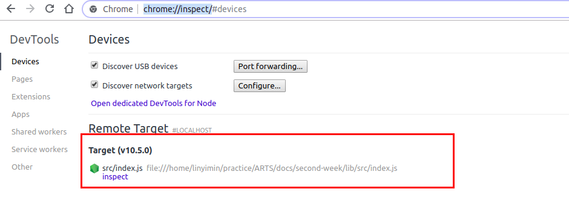
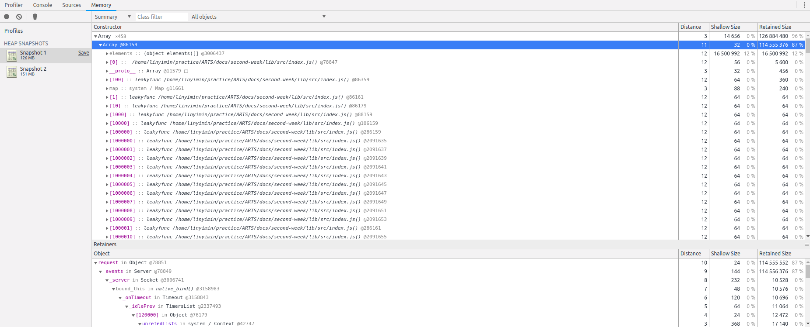

> Time: 2019.04.08 - 2019.04.15

> Algorithm: 3Sum
>  
> Review: How to self detect a memory leak in node
> 
> Share: Heap
> 
> Tip: 使用ssh配置文件管理ssh会话


<!-- TOC -->

- [Algorithm](#algorithm)
  - [实现思路](#实现思路)
  - [完整代码](#完整代码)
  - [参考链接](#参考链接)
- [Review](#review)
  - [追踪Node应用中的内存泄露](#追踪node应用中的内存泄露)
    - [一个简单的内存泄露例子](#一个简单的内存泄露例子)
    - [内存泄露探测](#内存泄露探测)
    - [内存泄露分析](#内存泄露分析)
- [Share](#share)
  - [堆的定义](#堆的定义)
  - [堆的存储](#堆的存储)
  - [堆化(Heapify)](#堆化heapify)
    - [实现堆化的两种操作](#实现堆化的两种操作)
      - [由上到下调整(shiftDown)](#由上到下调整shiftdown)
      - [由下到上调整(shiftUp)](#由下到上调整shiftup)
  - [堆常用的两种操作](#堆常用的两种操作)
    - [插入数据](#插入数据)
    - [删除数据(取出堆顶元素)](#删除数据取出堆顶元素)
  - [堆的应用](#堆的应用)
    - [堆排序](#堆排序)
- [Tip](#tip)
  - [使用ssh配置文件管理ssh会话](#使用ssh配置文件管理ssh会话)
    - [常用配置项](#常用配置项)
    - [例子](#例子)

<!-- /TOC -->

## Algorithm

> Given an array nums of n integers, are there elements a, b, c in nums such that a + b + c = 0? Find all unique triplets in the array which gives the sum of zero.

Note:

The solution set must not contain duplicate triplets.

Example:

```
Given array nums = [-1, 0, 1, 2, -1, -4],

A solution set is:
[
  [-1, 0, 1],
  [-1, -1, 2]
]
```


### 实现思路

由于三个元素相加和为0可以转换成两个元素相加等于第三个元素的负数.`a+b+c=0 => a+b=-c`, 所以可以采用以下方式完成:

1. 对数组元素进行排序
2. 遍历有序序列,每次取出一个元素作为第三个元素,然后在剩下的元素中找出其他两个元素.

```C

int** threeSum(int* nums, int numsSize, int* returnSize) {
  // 对数组元素进行排序(从小到大)
  qsort(nums, numsSize);
  // 存储结果, 由于不知道有几个,所以按照最大需求开辟内存空间
  int **result = (int **) malloc(sizeof(int*) * numsSize * numsSize);
  int count = 0; // 记录一共有多少对值
  for (int i = 0; i < numsSize - 2; i++) {
    int left = i + 1;
    int right = numsSize - 1;
    while (left < right) {
      if (nums[left] + nums[right] == -nums[i]) {
        result[count] = (int *) malloc(sizeof(int) * 3);
        result[count][0] = nums[i];
        result[count][1]= nums[left];
        result[count][2] = nums[right];
        count++;
        left++;
        right--;
      } else if (nums[left] + nums[right] > -nums[i]) {
        right--;
      } else {
        left++;
      }
    }
  }
  *returnSize = count;
  return result;
}
```

3. 去重
   1. 第一个元素存在连续相同时,只计算一次
   2. 当存在nums[left]+nums[right]=-nums[i]时, 两个游动时要跳过相等的元素

```C
int** threeSum(int* nums, int numsSize, int* returnSize) {
  // 对数组元素进行排序(从小到大)
  qsort(nums, numsSize);
  // 存储结果, 由于不知道有几个,所以按照最大需求开辟内存空间
  int **result = (int **) malloc(sizeof(int*) * numsSize * numsSize);
  int count = 0; // 记录一共有多少对值
  for (int i = 0; i < numsSize - 2; i++) {
    int left = i + 1;
    int right = numsSize - 1;
    while (left < right) {
      // 1. 第一个元素存在连续相同时,只计算一次
      if (i == 0 || nums[i - 1] != nums[i]) {
        if (nums[left] + nums[right] == -nums[i]) {
          result[count] = (int *) malloc(sizeof(int) * 3);
          result[count][0] = nums[i];
          result[count][1]= nums[left];
          result[count][2] = nums[right];
          count++;
          // 两个游标跳过相等的元素
          while(left < right && nums[left] == nums[left + 1]) {
            left++;
          }
          while (left < right && nums[right] == right[right - 1]) {
            right--;
          }
          left++;
          right--;
        } else if (nums[left] + nums[right] > -nums[i]) {
          right--;
        } else {
          left++;
        }
      }
    }
  }
  *returnSize = count;
  return result;
}
```

### 完整代码

```C
/**
 * Return an array of arrays of size *returnSize.
 * Note: The returned array must be malloced, assume caller calls free().
 */

// 快速排序
void swap (int *arr, int i, int j) {
  int temp = arr[i];
  arr[i] = arr[j];
  arr[j] = temp;
}

int partition(int *arr, int left, int right) {
  int pivot = left;
  for (int i = left; i< right; i++) {
    if (arr[i] < arr[right]) {
      swap (arr, pivot, i);
      pivot++;
    }
  }
  swap (arr, pivot, right);
  return pivot;
}

void __qsort(int *arr, int left, int right) {
  if (left >= right) {
    return;
  }
  int mid = partition(arr, left, right);
  __qsort(arr, left, mid - 1);
  __qsort(arr, mid + 1, right);
}

void sort(int * arr, int size) {
  __qsort(arr, 0, size - 1);
}

int** threeSum(int* nums, int numsSize, int* returnSize) {
  // 对数组元素进行排序(从小到大)
  sort(nums, numsSize);
  // 存储结果, 由于不知道有几个,所以按照最大需求开辟内存空间
  int **result = (int **) malloc(sizeof(int*) * numsSize * numsSize);
  int count = 0; // 记录一共有多少对值
  for (int i = 0; i < numsSize - 2; i++) {
    int left = i + 1;
    int right = numsSize - 1;
    while (left < right) {
      // 1. 第一个元素存在连续相同时,只计算一次
      if (i == 0 || nums[i - 1] != nums[i]) {
        if (nums[left] + nums[right] == -nums[i]) {
          result[count] = (int *) malloc(sizeof(int) * 3);
          result[count][0] = nums[i];
          result[count][1]= nums[left];
          result[count][2] = nums[right];
          count++;
          // // 两个游标跳过相等的元素
          while(left < right && nums[left] == nums[left + 1]) {
            left++;
          }
          while (left < right && nums[right] == nums[right - 1]) {
            right--;
          }
          left++;
          right--;
        } else if (nums[left] + nums[right] > -nums[i]) {
          right--;
        } else {
          left++;
        }
      } else {
          break;
      }
    }
  }
  *returnSize = count;
  return result;
}

```

### 参考链接

[Concise O(N^2) Java solution](https://leetcode.com/problems/3sum/discuss/7380/Concise-O(N2)-Java-solution)

## Review

[how-to-self-detect-a-memory-leak-in-node](https://www.nearform.com/blog/how-to-self-detect-a-memory-leak-in-node/)

### 追踪Node应用中的内存泄露

使用Node的--flag标签, `memwatch`和`heapdump`两个很棒的工具完成Node应用的内存泄露跟踪

#### 一个简单的内存泄露例子

```javascript
const http = require('http');

var server = http.createServer((req, res) => {
 for (var i=0; i<1000; i++) {
 server.on('request', function leakyfunc() {});
 }

 res.end('Hello World\n');
}).listen(1337, '127.0.0.1');
server.setMaxListeners(0);

console.log('Server running at http://127.0.0.1:1337/. Process PID: ', process.pid);
```

上诉的代码,我们为每个请求添加了额外的1000个监听者.然后使用`autocannonn`进行压测. `autocannon`是一个node实现的压测工具, 使用`sudo npm install autocannon -g`进行安装.

在一个终端中运行`autocannon -c 1 -d 60 http://localhost:1337`进行施压. 


然后打开另一个终端使用`top | head -1; top | grep <process pid>`上面例子对应的进程的内存使用量非常高,而且很不稳定. 


接下来我们如何进行分析呢?

#### 内存泄露探测

`node-memwatch`更适合检测内存泄露. 首先在我们的项目中使用`npm install --save node-memwatch`安装, 然后在代码中添加:

```javascript
const memwatch = require('node-memwatch')

// 添加泄漏事件的监听器
memwatch.on('leak', (info) => {
  console.log('Memory leak detected:\n', info)
})
```

然后继续运行我们的程序, 现在终端会输出以下结果:


可以看到`memwatch`检测到了内存泄露, `memwatch`对泄露事件的定义是: 如果经过连续5次GC, 内存仍被持续分配而没有得到释放

#### 内存泄露分析

接下来, 我们要找出程序哪里出现了内存泄露.虽然我们上面的例子泄露很明显, 但是分析的步骤是一样的:

1. 在不同的时间间隔创建堆存储
2. 比较不同时间间隔的堆存储, 找出什么增长了

有两种方式可以完成上述分析:

1. `--flag`标签

```shell
$ node --inspect index.js
```

打开浏览器,在地址栏输入`chrome://inspect/`, 然后选择`inspect`



使用命令`autocannon -c 1 -d 60 http://localhost:1337`加压

然后点击取得快照, 30秒后在取一次




关于内存更精彩的分析可以查看[Taming The Unicorn: Easing JavaScript Memory Profiling In Chrome DevTools](https://addyosmani.com/blog/taming-the-unicorn-easing-javascript-memory-profiling-in-devtools/)

2. 使用`Heapdump`

`node-heapdump`是一个非常好的工具, 可以在应用代码内部生成一个快照.关于更过`heapdump`可以查看[blog post](https://strongloop.com/strongblog/how-to-heap-snapshots/).现在我们直接在代码中使用`heapdump`, 在每次检查到内存泄露时, 将V8栈快照信息写到磁盘上.

```javascript
memwatch.on('leak', (info) => {
  console.error('Memory leak detected:\n', info);
  heapdump.writeSnapshot((err, filename) => {
    if (err) console.error(err);
    else console.error('Wrote snapshot: ' + filename);
})
```


可以看到生成了相关的快照文件, 导入DevTools即可得到与之前`--inspect`一样的效果.

## Share

> C语言实现一个堆

### 堆的定义

- 堆是一颗完全二叉树
- 每个节点的值都大于其子树每个节点的值(最大堆)

### 堆的存储

由于堆是一颗完全二叉树,所以非常适合使用数组进行存储.

> 使用数组存储堆, 可以使用数组下标查找指定节点的左右孩子节点和其父节点, 假设节点所在数组索引为`i`, 则:

父节点: <font color>="#dd0000>parent(i) = i / 2</font>
左孩子: <font color>="#dd0000>left(i) = 2 * i</font>
右孩子: <font color>="#dd0000>right(i) = 2 * i + 1</font>/


### 堆化(Heapify)

往堆中插入新的元素或者删除元素之后,数组对应的完全二叉树会不满足堆的性质, 需要进行相关的调整, 使其重新满足堆的特性的过程就是<font color="#dd0000">堆化<font/>

#### 实现堆化的两种操作

##### 由上到下调整(shiftDown)

在删除操作中会使用`shiftDown`操作实现数组的堆化

**堆化过程**

设需要调整的元素对应的索引是`i`:

1. 先与左右孩子进行比较,若大于左右孩子的值,说明数组对应的结构满足堆的定义,堆化完成
2. 若小于左右孩子节点, 则与较大的孩子节点交换位置, 易知, 若较大的孩子节点为左孩子, 则交换后原来索引`i`对应的节点索引变为`2 * i`(完全二叉树的定义), 若较大的孩子节点为右孩子节点, 则交换后原来索引`i`对应的节点索引变为`2 * i+ 1`
3. 重复第一、第二步, 直至数组对应的完全二叉树满足堆的定义。

##### 由下到上调整(shiftUp)

在插入操作中会使用`shitUp`操作实现数组的堆化

**堆化过程**

设需要调整的元素对应的索引是`i`:

1. 先与父节点进行比较,若小于父节点的值,说明数组对应的结构满足堆的定义,堆化完成
2. 若小于父节点对应的值, 则与父节点交换位置, 易知, 则交换后原来索引`i`对应的节点索引变为`i / 2`(完全二叉树的定义)
3. 重复第一、第二步, 直至数组对应的完全二叉树满足堆的定义。


### 堆常用的两种操作

#### 插入数据

1. 将新元素放置数组末尾
2. 对数组末尾元素进行`shiftUp`操作


#### 删除数据(取出堆顶元素)

1. 取出数组末尾元素与堆顶元素交换
2. 对堆顶元素进行`shiftDown`操作


### 堆的应用

#### 堆排序

堆排序由两个步骤完成：

1. 建堆
2. 排序

## Tip

### 使用ssh配置文件管理ssh会话

如果拥有多个 SSH 账号，在终端里直接 SSH 登陆要记住每个 SSH 账号的参数是件不容易的事，而且比较浪费精力和时间。ssh提供了一种很优雅的方式解决这个问题.

> ssh配置文件

```
用户配置文件: ~/.ssh/config
系统配置文件: /etc/ssh/ssh_config
```

配置文件可分为多个配置区段，每个配置区段使用"Host"来区分。

#### 常用配置项

- Host 别名
- HostName 主机名
- Port 端口
- User 用户名
- IdentityFile 密钥文件的路径
- IdentitiesOnly 只接受SSH key 登录
- PreferredAuthentications 强制使用Public Key验证 

#### 例子

```
Host    padpro
        HostName 52.82.35.148
        User root
        IdentityFile /home/linyimin/.ssh/id_rsa
```

这样在终端直接使用`ssh padpro`即可连接上主机,不需要去记任何参数